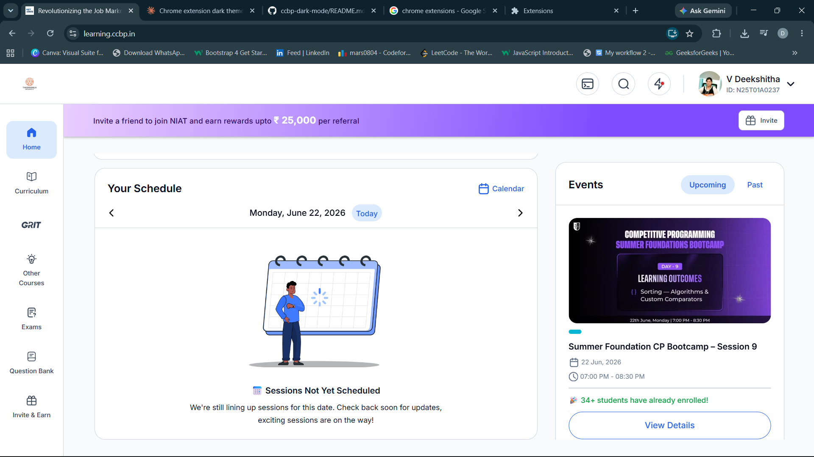
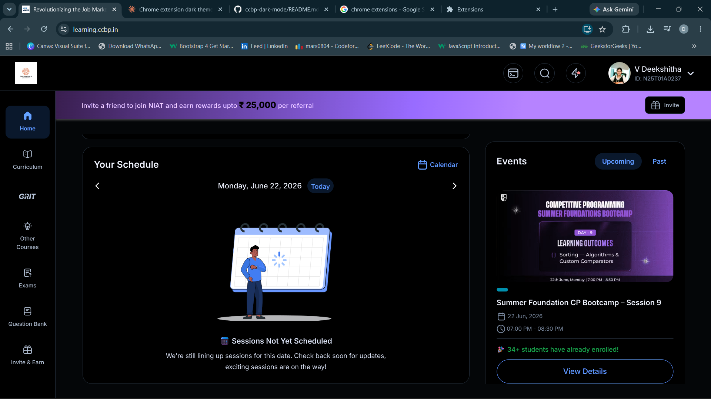

# 🌙 Dark Mode for CCBP Learning Portal

> Tired of the bright white screen at night? This extension adds a smooth dark mode to [learning.ccbp.in](https://learning.ccbp.in) with one click.


---

## 🖼️ Preview

| Light Mode | Dark Mode |
|:----------:|:---------:|
|  |  |

---

## ✨ Features

- 🌙 One-click dark mode toggle
- 💾 Remembers your preference across sessions
- ⚡ Works instantly on page navigation (SPA-friendly)
- 🎥 Videos render with correct colors (counter-inversion applied)
- 🎯 Built specifically for CCBP / NxtWave learning portal

---

## 📦 Installation

> Not on the Chrome Web Store yet — install manually in 30 seconds:

1. Click the green **Code** button on this repo → **Download ZIP**
2. **Extract** the ZIP on your computer
3. Open Chrome and go to `chrome://extensions`
4. Enable **Developer Mode** (toggle in top-right corner)
5. Click **Load unpacked**
6. Select the extracted folder (the one containing `manifest.json`)
7. Go to [learning.ccbp.in](https://learning.ccbp.in) and click the 🌙 icon in your toolbar

---

## 🔧 How It Works

The extension injects a CSS filter (`invert + hue-rotate`) on the page shell via Chrome's Scripting API (Manifest V3). The Video.js player and images are counter-inverted so they render with correct colors. Your dark mode preference is saved in `chrome.storage.local` and auto-applied on every page load.

```
ccbp-dark-mode/
├── manifest.json      # Extension config (Manifest V3)
├── background.js      # Service worker — handles CSS injection + state
├── content.js         # Lightweight page script
├── popup.html         # Toggle UI
├── popup.js           # Popup logic
└── icons/             # Extension icons
```

---

## ⚠️ Known Limitations

- **Google Slides** embedded in lectures remain light — this is a browser cross-origin security restriction, not a bug. Nothing can style inside a cross-origin iframe.
- Dark mode applies **only** to `learning.ccbp.in`

---

## 🐛 Issues / Feedback

Found a page that looks broken in dark mode? [Open an issue](../../issues) with a screenshot and I'll fix it.

---

## 🙌 Contributing

Pull requests are welcome! Ideas for future improvements:
- Custom color themes
- Scheduled dark mode (auto on/off by time)
- Brightness/contrast controls

Fork the repo and submit a PR!

---

## 👩‍💻 Author

**V Deekshitha**
- GitHub: [@deekshu0804](https://github.com/deekshu0804)

---

## 📄 License

MIT — free to use, modify, and share.
